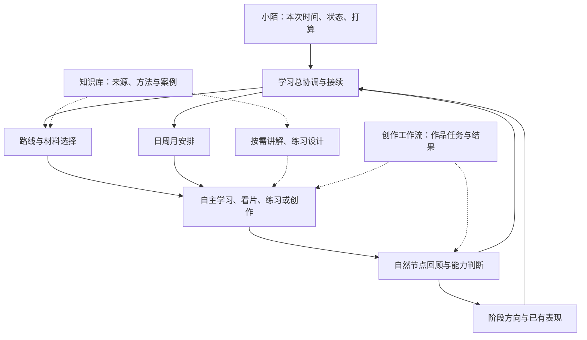

# 小陌的学习系统：功能蓝图 v0.1

日期：2026-09-23。状态：**讨论稿，尚未作为运行规则采用或实现**。

依据：`建设共识.md`、小陌七项个人情况回答、本次本地职责核查，以及 `参考案例调研_2026-09-23.md`。下文的功能分工、记录方式和阶段安排均为待讨论的设计建议；不能覆盖已经确认的用户需求。

## 1. 建议的整体形态

一个统一的学习交流入口，内部由六项专业能力支持；知识库提供资料与方法，创作工作流提供实际应用场景和项目结果。

小陌负责表达目标、告知变化、自主学习与创作、带回结果和感受。系统负责接续方向、整理选择、安排可做的一步、提供按需帮助和有依据的回顾。

用户不需要每天分别管理多个岗位任务或重复报备。专业能力按当前问题调用；并行代理只在确有独立工作时使用，不是固定每日流程。

## 2. 功能分工与技能候选

下表是一种职责完整的首版拆分，不是技能数量上限。候选名称用于讨论，尚未创建或安装。

| 功能 | 负责什么 | 主要输出与边界 | 初步建设判断 |
|---|---|---|---|
| **学习总协调与接续** | 读取已采用重点、当前安排和上次停止处，理解本次意图，按需调用专业能力 | 一致的当前状态、下一步入口和跨系统交接；不代替所有专业判断 | 新建总入口，维护学习侧当前状态 |
| **学习路线与材料选择** | 将阶段目标转成能力任务，结合已有表现识别必要先修、材料与适当顺序 | 阶段路线及选材理由；不按课程数量或库中空白机械补齐 | 新建；利用知识库检索与专业来源 |
| **日周月安排与重排** | 按当前容量安排学习、练习、创作、休息和收尾；条件变化时调整 | 可执行安排，说明轻重与取舍；不扩成全天生活管理 | 新建，统一处理三个时间尺度 |
| **讲解与理解支持** | 针对小陌主动提出的困惑解释、举例、对照和答疑 | 帮助理解当前问题；不在每节课自动插入问答 | 优先复用 `internalize-film-knowledge` 的讲解能力，随后按职责调整 |
| **练习与作品学习** | 设计低成本练习，帮助围绕学习目标看作品、比较版本、练习多专业串联 | 练习任务、适量观察提示和反馈依据；自由看片仍可不形成任务，正式创作执行回工作流 | 新建；与已有专业知识和拉片工具按需衔接 |
| **能力证据与阶段判断** | 区分理解、操作、判断、迁移表现，结合帮助程度判断本阶段是否够用 | 带依据的能力结论和继续/补练/转向建议；不据自评或单次 AI 评分认证掌握 | 复用现有理解检验，新增实际操作和综合任务证据部分 |
| **学习复盘与调整建议** | 在自然小块、周或月/阶段结束时回看结果、方法、估时和感受 | 可执行的调整建议；计划模块负责落实安排，总协调负责记录采用状态 | 新建，避免重复创建多个互相竞争的复盘入口 |

跨系统交接作为总协调的明确职责，调用知识库与工作流已有入口；若试运行证明它复杂到需要独立技能，再单独拆分。

A/B/C1/C2/D/E 用来标识学习内容与应用位置。首版不为六岗位分别复制上述七项能力，也不为每个技能另开用户必须维护的聊天任务。

## 3. 日、周、月怎样协作

参考 [Cal Newport 的多尺度安排](https://calnewport.com/projects-vs-tasks-a-critical-distinction-in-productive-scheduling/)与 [Super Productivity 的按天容量规划](https://github.com/super-productivity/super-productivity/wiki/4.03-Planner-View)，结合用户需求提出以下设计。

| 尺度 | 决定什么 | 怎样被修正 |
|---|---|---|
| 月或阶段 | 近期重点、希望获得的能力与成果、主要材料和练习方向 | 根据代表性表现、兴趣变化及用户告知的现实变化调整 |
| 周 | 本周从阶段方向推进什么，哪些材料与练习相互配合 | 根据实际完成、估时偏差和反馈增减任务 |
| 当天或一次学习 | 在今天可用时间和状态下，具体推进哪一小块，怎样留出休息和收尾 | 条件变化时缩减、调换、暂停或续接；不默认加班补齐 |

每天启动只了解有变化的信息，不重复问完整背景。先给重点、顺序和大致投入；有需要时再排到时刻。没有安排的空闲不自动变成学习时间。

较长计划只展开到目前能合理判断的程度，不把未来几个月全部拆成不可变的小任务。每周/月可以回顾，但回顾未发生时不编造记录、不积累必须补交的日报。

当天安排中的主任务、可选项、休息和收尾应当容易辨认，表达可以自然，不要求每天固定表格。专注时长参考小陌实际体验，不预设统一番茄钟参数。

## 4. 学习活动怎样组织

参考 [4C/ID](https://www.4cid.org/about/)与 [GSD 的课程和 studio 并行实践](https://www.gsd.harvard.edu/offices-and-facilities/admissions-office/life-at-the-gsd/academic-experience/)，安排中保留以下活动，各自服务不同需要：

- **基础学习**：课程、文章、书籍帮助建立概念框架，不能全部被临时查步骤取代。
- **作品观察**：需要学习时围绕具体问题观察；自由看片保持自由，事后有发现也可以再交流。
- **针对性练习**：用少量材料练一个明确能力；不要求一开始就生成昂贵完整影片。
- **综合实践**：在小任务或真实项目中协调故事、镜头、剪辑与声音，解决“单项会、串起来困难”。
- **回顾与必要回访**：只围绕关键疑点、值得保留的知识与实际表现展开，不给所有笔记安排复习债务。

一个材料可能支持多个能力，课程不必逐章各自产生任务；学习路线可以根据问题前进，也可以在实际应用后返回基础。

示例仅说明机制：如果阶段目标是对话段落的镜头衔接，可以先学习所选材料，用已有镜头或静帧排列一个小段，说明视线和信息顺序的取舍，再根据实际结果决定补哪一部分。静帧练习不证明最终动态生成质量已经解决。

## 5. 怎样了解能力与决定“暂时够用”

参考 [CMU 的目标、活动与评估对齐](https://www.cmu.edu/teaching/assessment/basics/alignment.html)，先明确本阶段希望能做的事情，再观察相应表现。

能力记录建议同时保留：任务和难度范围、日期、用户实际表现、使用了哪些帮助、材料或产物位置、判断依据与仍不确定的部分。只记录有用的信息，不要求用户逐字段填写。

以下信息分开保存和理解：

- 用户自述与感受。
- 是否接触或完成某份材料。
- 对概念的解释、辨析与判断。
- 在实际任务中的操作和应用表现。
- 在新材料或相隔一段时间后的再次表现。
- 具体作品的观看反馈、采用或商业结果。

已有 `能复述/能辨析/能迁移` 可继续用于概念理解，但不能替代完整影视能力描述。单个成功案例可以说明该次表现，不自动推断所有情境都已熟练。

“暂时够用”对应一个具体阶段目标：关键任务已能在约定帮助程度下完成，剩余问题不妨碍下一步，可以带着适量回访继续前进。存在关键先修缺口时解释影响并建议补练；不因记忆评分不足就一律禁止新学习。

审美取舍看意图与效果，不能当作唯一正确答案。AI 无法直接观察的结果标为用户报告；来源有争议时先核查依据，不能把资料问题算成用户错误。

## 6. 自然回顾、适度督促与重新开始

参考 [CMU Exam Wrappers](https://www.cmu.edu/teaching/designteach/teach/examwrappers/)，复盘把具体结果连到下一次行动。日常回顾可以很短，重复困难或阶段结束时再深入。

小陌带回一段学习或创作经历时，先回应其实际内容，再按需要解释、辨析或查看成果。缺少关键依据时提出一个具体问题，不自动开始连续考试。

督促发生在当前对话和用户主动返回的节点：

- 频繁换方向时，说明对现有重点的影响，让用户有意识地选择。
- 计划过满或状态下降时，帮助缩小任务，而不是提高自律要求。
- 未完成时区分难度、材料、估时、工具、现实变化等原因，再决定继续、调整、暂停或放下。
- 休息后返回时给出容易接上的下一步，不要求补交缺失记录。

周回顾关注推进和安排是否合适；月或阶段回顾关注能力方向是否仍值得投入。两个尺度引用同一批实际记录，避免重新写一遍学习日志。

本方案没有后台监控、自动催促或定时提醒。将来如有此需要，作为独立可选能力讨论。

## 7. 三个系统的事实归属与接续

| 信息 | 主要维护位置 | 其他系统怎样使用 |
|---|---|---|
| 个人偏好、阶段目标、学习安排 | 学习系统 | 需要时提供与当前任务有关的简要背景 |
| 个人学习表现与能力证据 | 学习系统 | 知识库可保留明确选择的个人理解链接或记录，不维护第二份竞争状态 |
| 原始来源笔记、主题知识、可复用方法 | 知识库 | 学习系统保存入口与选择理由，不复制完整资料库 |
| 正式剧本、素材、成片与作品反馈 | 创作工作流 | 学习系统引用实际版本和有关片段，提取个人学习启示 |
| 对新机制的设计建议 | 当前系统的设计材料 | 未采用前不写入运行规则或其他系统 |

本次核验发现：现有 `internalize-film-knowledge` 的保存目标仍与知识库绑定，`operate-personal-knowledge-tree` 仍有学习启动/选题职责。未来拆分要同时处理调用入口、记录归属和兼容方式；仅复制一个技能目录会留下两个学习状态来源。

建议分步衔接：先以明确来源和项目路径做只读引用，跑通学习侧组织与反馈；再针对已采用的接口设计修改现有入口。调用 `apply-film-knowledge` 时仍遵守当前阅读范围，不把新系统建立理解为全库读取与跨区写回授权。

学习区仍然可以保存课程资料；“学习区”这个名字不表示其中必须继续承担个人学习调度。此方案不包含重命名或迁移知识库目录。

## 8. 文件与记录的候选结构

采用本地可读文件的理由是便于继续讨论、校正和跨任务接续。[Tutor 的文件状态](https://github.com/YusenZhang0601/tutor)提供结构参考，但其完整协议与门禁不照搬。

先区分以下内容对象，具体文件名与格式留给结构设计阶段：

| 内容对象 | 保存什么 | 防止什么重复 |
|---|---|---|
| 个人情况 | 用户确认偏好、有日期的现实情况与能力自述 | 不每天重做问卷，不把短期状态升级为永久规则 |
| 当前学习状态 | 当前采用的方向、有效计划入口、上次停止处 | 只保存当前指向，不复制所有历史和整个知识库 |
| 阶段路线与安排 | 目标、材料入口、练习与检查方式，以及月/周方向 | 当天安排引用它，不每天重新生成长期路线 |
| 学习与练习记录 | 用户实际报告、实际产物、困惑与当次判断 | 原始证据有位置，摘要不冒充新证据 |
| 能力依据 | 能力判断与支撑记录的关联、帮助程度和限制 | 不用多个文件各自维护不同掌握结论 |
| 阶段复盘与调整 | 调整建议、采用结果及理由 | 未采用建议不自动成为任务 |
| 系统设计与 Skills | 协作规则、专业能力、必要的读取和校验工具 | 日常学习不被系统维护任务抢占 |

写入边界需要在首次运行前明确一次：哪些启动、收尾或回顾请求包含保存安排和事实记录，哪些个人评价或跨系统内容另需明确采用。已经授权的日常范围不反复询问。当前讨论稿不自行扩大现有保存授权。

多个任务接续时应读取当前文件并合并相关改动；专业能力提供建议和证据，由总协调汇合学习侧当前状态，避免并行覆盖。

## 9. 建设顺序与验证方式

### 第一阶段：确定框架与职责

讨论本稿的功能分工、用户使用过程与记录归属。此时完成的是设计，尚不能宣称系统有效。

### 第二阶段：搭建可完整走一轮的版本

建立所需入口、状态读取、路线与日安排、按需帮助、自然收尾和续接，复用已有专业能力，补齐必要新技能。避免只做排课入口而没有反馈和调整。

### 第三阶段：补齐跨系统衔接

按已采用的接口设计，处理旧学习职责与新记录归属，保留知识库和创作流程各自的真实来源。每次改动有范围、验证和恢复方式。

### 第四阶段：真实试运行与修订

从小陌实际选择的一段学习和作品应用开始，观察启动是否容易、安排是否符合容量、学习是否进入实际表现、反复切换是否减少，以及记录负担是否可接受。比较真实变化，不给没有依据的学习效率百分比。

以下为将来需要验证的场景，本轮尚未执行：

| 场景 | 应有表现 |
|---|---|
| 下午时间较多，想继续上一阶段内容 | 能接续当前方向，给适量学习与练习，保留休息 |
| 临时只剩晚间一小段时间 | 缩小任务，说明暂停或顺延的内容，不重新规划全部路线 |
| 看完一块课程主动回来交流 | 先回应真实理解，按需要补充或检验，不固定要求长复盘 |
| 今天只想看一部电影 | 尊重欣赏意图；需要学习帮助时再提供观察方向 |
| 休息或分心后重新回来 | 找回停止处，给可继续的一步，不把缺记录当失败 |
| 用户认为编剧暂时够用，想转镜头 | 根据目标和已有表现提出判断，说明依据不足处，允许有意识地转向 |
| 开了新 Codex 任务 | 从当前文件恢复背景，不重复七项问卷，也不编造上次未记录的表现 |
| 想把一个体会保存为知识 | 区分个人感受、候选方法与有依据的知识，经已有知识库入口处理 |

## 10. 当前建议与开放问题

建议先讨论并采用功能架构和接口责任，再决定 Skills 的实际名称、拆分和文件组织。材料清单、具体主攻主题与日程是运行时输入，现在不需要补问一轮。

后续需要共同确定但不阻塞本稿的问题：日常记录默认保存范围、能力依据如何呈现、跨系统旧学习职责分几步调整。具体课表、固定时间比例、自动提醒与学习评分阈值均未确定。

本轮实际完成：公开案例调研、本地职责核查、候选蓝图文档。未创建运行技能、未修改其他系统、未安排具体学习任务、未验证个人学习收益。
